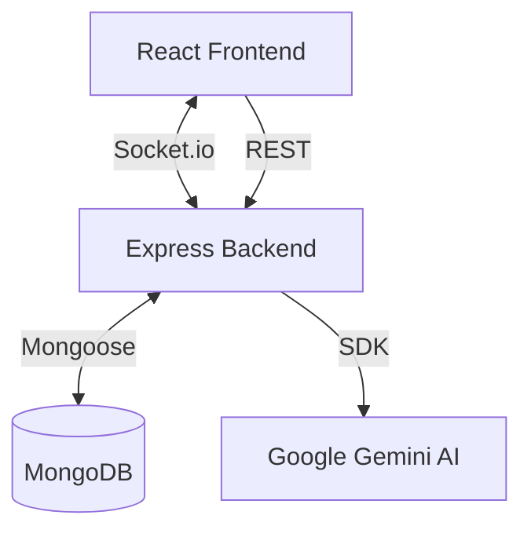

# 🏗️ Nexus Architecture Documentation

This document provides a technical deep dive into the architecture, data flow, and design patterns used in the Nexus project.

---

## 🗺️ System Overview

Nexus follows a decoupled **MERN** (MongoDB, Express, React, Node) architecture with a heavy emphasis on real-time event-driven communication via **Socket.io**.

### High-Level Diagram

---

## 🎨 Frontend Architecture

The frontend is built with **React 19** and **Vite**, utilizing a modular component structure.

### 1. Canvas Engine (React Flow)
- **React Flow** is the core of the infinite canvas.
- Custom nodes (`CustomNode.jsx`, `SWOTNode.jsx`, etc.) are implemented to handle specialized diagramming tasks.
- The canvas state (nodes, edges) is synchronized via a global Zustand store.

### 2. State Management (Zustand)
- **Store Path:** `frontend/src/store/`
- We use Zustand for its simplicity and atomic updates, crucial for high-performance canvas movements.
- **Stores:** `useNodeStore`, `useAuthStore`, `useGameStore` (XP/Leveling).

### 3. Real-Time Synchronization
- Socket hooks manage the connection state.
- **Events:** `node:change`, `edge:change`, `cursor:move`.
- Optimistic updates are used on the frontend to ensure zero-latency feel.

---

## ⚙️ Backend Architecture

The backend is a **Node.js** environment using **Express 5**.

### 1. API Structure
- **Routes:** Decoupled by resource (`/api/auth`, `/api/graphs`, `/api/nodes`).
- **Middleware:** JWT verification and global error handling.

### 2. Data Models (Mongoose)
- **User:** Authentication, XP, and badges.
- **Graph:** Metadata about diagrams.
- **Node/Edge:** Relational data within a graph.

### 3. AI Integration
- Uses `@google/generative-ai` to interact with Gemini.
- Features include automated node generation, content summarization, and "Smart Suggestions" for mind maps.

---

## 🛰️ Performance Optimizations

1. **Debounced Socket Emissions:** Prevent overwhelming the server during rapid node dragging.
2. **Virtualization:** React Flow handles large-scale graphs by only rendering visible nodes.
3. **Asset Optimization:** Vite-based bundling and code-splitting for fast initial loads.

---
*For development setup, see [CONTRIBUTING.md](CONTRIBUTING.md).*
